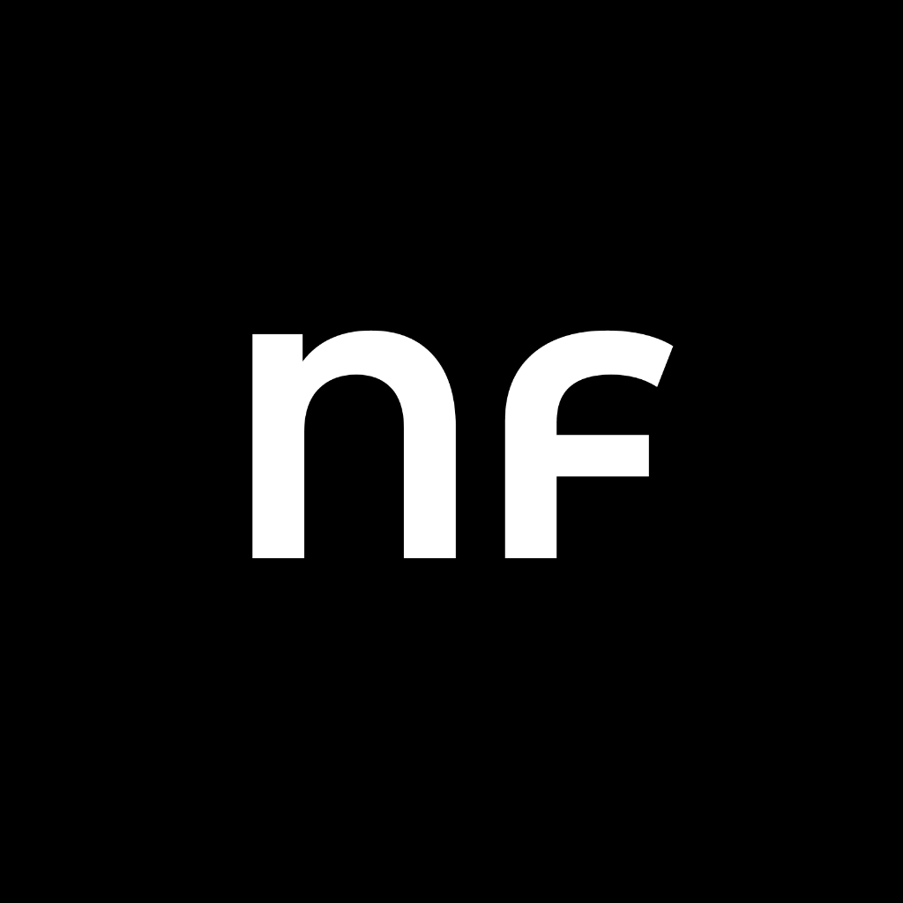

# NeverForgett - Subscription Manager



## Overview

NeverForgett is a comprehensive subscription management application built with React Native and Expo. It helps users track and manage their recurring subscriptions, providing insights into monthly and annual spending, upcoming renewals, and spending breakdown by category.

## Features

- **Dashboard Overview**: View total monthly and annual subscription costs at a glance
- **Subscription Tracking**: Add, edit, and delete subscription details
- **Renewal Reminders**: Set up notifications for upcoming subscription renewals
- **Category Management**: Organize subscriptions by categories with color coding
- **Search & Filter**: Easily find subscriptions by name, category, or notes
- **Spending Analytics**: Visualize spending patterns across different categories
- **Upcoming Renewals**: Get notified about subscriptions renewing in the next few days

## Tech Stack

- **React Native**: Cross-platform mobile framework
- **Expo**: Development platform for React Native
- **TypeScript**: Type-safe JavaScript
- **Zustand**: State management
- **Async Storage**: Local data persistence
- **Expo Router**: Navigation and routing
- **Expo Notifications**: Push notifications for renewal reminders

## Getting Started

### Prerequisites

- Node.js (v16 or later)
- npm or bun package manager
- Expo CLI

### Installation

1. Clone the repository

```bash
git clone https://github.com/manuelduarte077/neverforgett.git
cd neverforgett
```

2. Install dependencies

```bash
npm install
# or
bun install
```

3. Start the development server

```bash
npm run dev
# or
bun dev
```

4. Open the app on your device using Expo Go or run on a simulator

## Project Structure

```
├── app/                  # App screens and navigation
│   ├── (tabs)/           # Tab-based navigation screens
│   └── ...               # Other screens
├── assets/               # Images, fonts, and other static assets
├── components/           # Reusable UI components
├── hooks/                # Custom React hooks
├── services/             # Services like notifications
├── store/                # Zustand store for state management
├── types/                # TypeScript type definitions
└── ...                   # Configuration files
```

## Usage

### Adding a Subscription

1. Tap the + button on the dashboard
2. Fill in the subscription details (name, cost, renewal date, etc.)
3. Select a category
4. Save the subscription

### Setting Up Reminders

1. Open a subscription
2. Tap on "Set Reminder"
3. Configure when you want to be reminded before renewal
4. Save the reminder settings

### Viewing Analytics

The dashboard provides an overview of your subscription spending, including:
- Total monthly cost
- Total annual cost
- Number of active subscriptions
- Upcoming renewals in the next 7 days

## Building for Production

### iOS/Android

Use EAS Build to create native builds:

```bash
eas build --platform ios
eas build --platform android
```


## Acknowledgements

- [Expo](https://expo.dev)
- [React Native](https://reactnative.dev)
- [Zustand](https://github.com/pmndrs/zustand)
